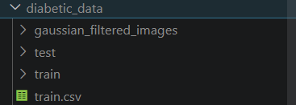

# Diabetic Retinopathy Detection using Deep Learning + RAG Chatbot

## Project Highlights
* CNN-based medical image classification
* AI Chatbot (RAG + Ollama) for explanations
* FastAPI backend + Streamlit UI
* Real-world healthcare application
  
## Overview
Diabetic Retinopathy is a serious eye disease caused by diabetes that can lead to blindness if not detected early.

This project presents a deep learning-based system that automatically detects diabetic retinopathy from retinal images.

Additionally, the system integrates an AI-powered chatbot using Retrieval-Augmented Generation (RAG) with Ollama, enabling users to:

* Understand predictions
* Learn symptoms
* Get medical insights interactively

## Problem Statement
* Manual diagnosis depends heavily on expert ophthalmologists
* Time-consuming → not scalable for large populations
* Limited access to specialists in rural areas
* Leads to delayed detection & vision loss risk

## Solution
This project proposes an AI-powered automated screening system:

* Uses CNN (Convolutional Neural Network) for image classification
* Detects stages of diabetic retinopathy from fundus images
* Integrates RAG-based chatbot (Ollama) for explanation & guidance

## Features
* Upload Retinal Image
* Automatic Disease Prediction
* Fast & Accurate Classification
* AI Chatbot Assistance (RAG + Ollama)
* User-Friendly Interface (Streamlit / FastAPI)

## Tech Stack
* Python
* PyTorch
* RAG (Retrieval-Augmented Generation)
* LLM
* LangChain
* Pandas
* FastAPI
* Streamlit
* Ollama

## Results
* The model performs well for No DR classification with high accuracy.
* There is noticeable confusion between Mild, Moderate, and Severe stages, indicating scope for improvement in fine-grained classification.
* Performance on advanced stages like Proliferative DR needs further optimization.

## Output / Confusion Matrix
<p align="center"> 
   
</p> 

## Limitations
* Class imbalance in dataset
* Similar visual patterns between DR stages
* Limited performance on advanced disease stages

## UI Preview
### Home Screen 
<p align="center"> 
   
</p> 

### Upload Section
<p align="center">
   
</p> 

## Model Output
<p align="center">  
</p> 

## Chatbot
<p align="center"> 
</p> <br>

<p align="center"> 
   
</p>

# How to Run

## 1. Clone Repository
```bash
git clone https://github.com/PRathammadan1/diabetic_retinopathy_rag.git
cd diabetic_retinopathy_rag
```

## 2. Install Dependencies
```bash
pip install -r requirements.txt
```

## 3. Download Dataset
Download the dataset from Kaggle:

👉 https://www.kaggle.com/datasets/xxxxx/diabetic-retinopathy-detection

After downloading:
- Extract the dataset
<p align="center"> 
   
</p>

* Place it inside the project folder (e.g., /diabetic_data)

## 4. Run Backend
```bash
uvicorn app:app --reload
```

## 5. Run Frontend
```bash
streamlit run app.py
```

## Future Improvements
* Improve classification for severe stages
* Deploy on cloud (AWS / HuggingFace Spaces)
* Add real-time doctor consultation
* Doctor recommendation system based on disease severity
* Suggest nearby ophthalmologists for consultation
* Integration with hospital APIs for appointment booking


