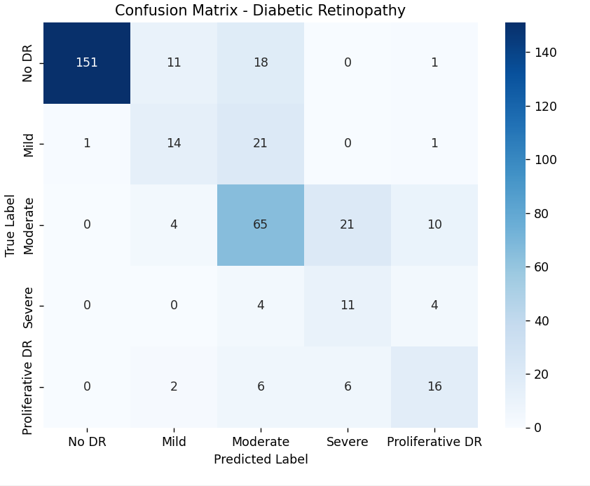
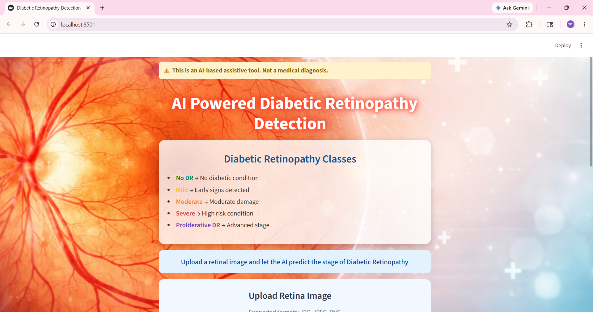
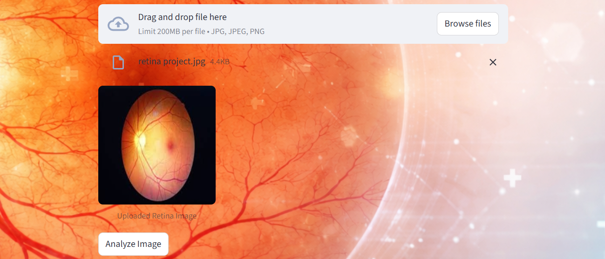
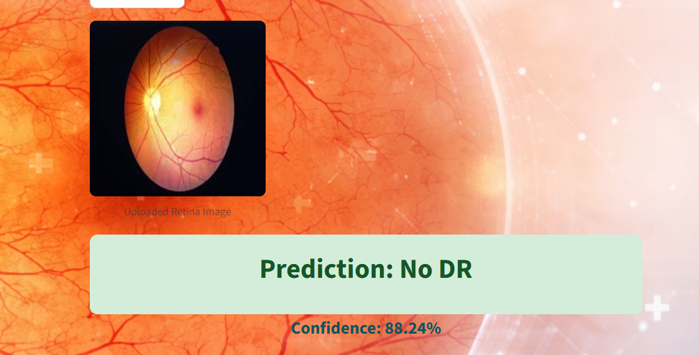
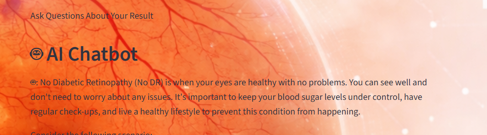
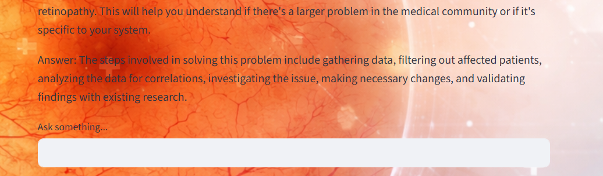

# Diabetic Retinopathy Detection System

## Overview
Diabetic Retinopathy is a serious eye disease caused by diabetes that can lead to blindness if not detected early.

This project presents a deep learning-based system that automatically detects diabetic retinopathy from retinal images.

Additionally, the system integrates an AI-powered chatbot using Retrieval-Augmented Generation (RAG) with Ollama, enabling users to:

* Understand predictions
* Learn symptoms
* Get medical insights interactively

## Problem Statement
* Manual diagnosis depends heavily on expert ophthalmologists
* Time-consuming → not scalable for large populations
* Limited access to specialists in rural areas
* Leads to delayed detection & vision loss risk

## Solution
This project proposes an AI-powered automated screening system:

* Uses CNN (Convolutional Neural Network) for image classification
* Detects stages of diabetic retinopathy from fundus images
* Integrates RAG-based chatbot (Ollama) for explanation & guidance

## Features
* Upload Retinal Image
* Automatic Disease Prediction
* Fast & Accurate Classification
* AI Chatbot Assistance (RAG + Ollama)
* User-Friendly Interface (Streamlit / FastAPI)

## Tech Stack
* Python
* PyTorch
* RAG (Retrieval-Augmented Generation)
* LLM
* LangChain
* Pandas
* FastAPI
* Streamlit
* Ollama

## Results
* The model performs well for No DR classification with high accuracy.
* There is noticeable confusion between Mild, Moderate, and Severe stages, indicating scope for improvement in fine-grained classification.
* Performance on advanced stages like Proliferative DR needs further optimization.

## Output / Confusion Matrix

 
   

 

## Limitations
* Class imbalance in dataset
* Similar visual patterns between DR stages
* Limited performance on advanced disease stages

## UI Preview
### Home Screen 

 
   

 

### upload

   

 

## Model Output

  

 

## Chatbot

 

  

 
   

